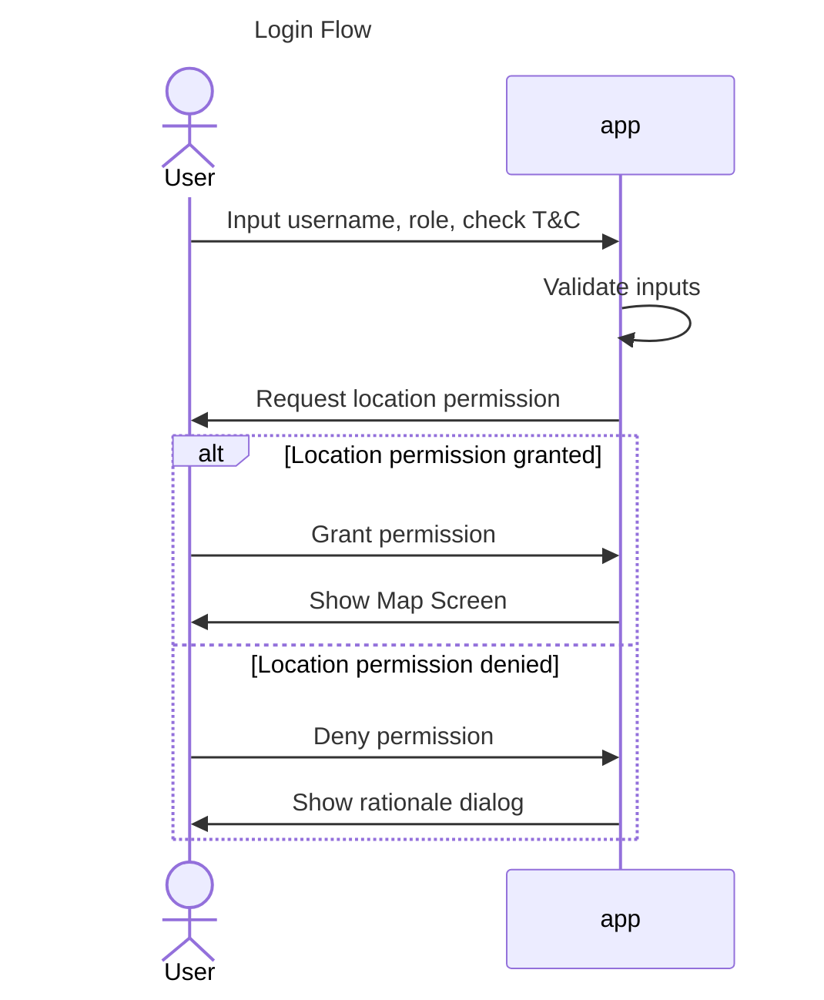
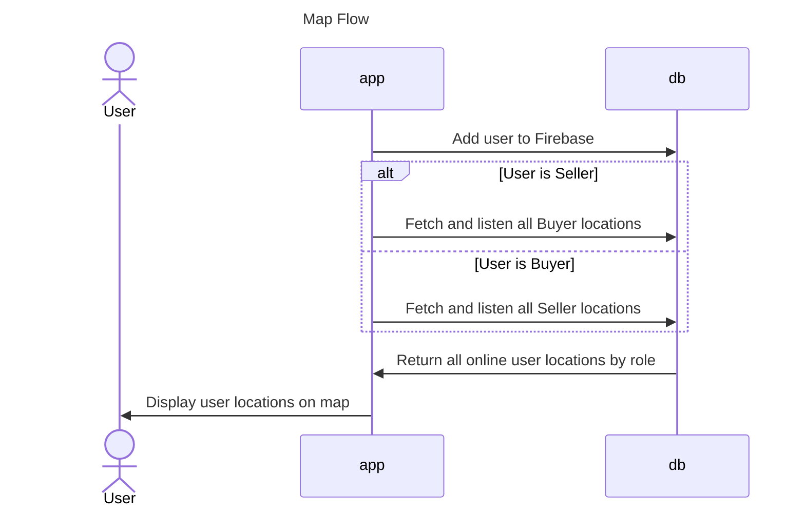
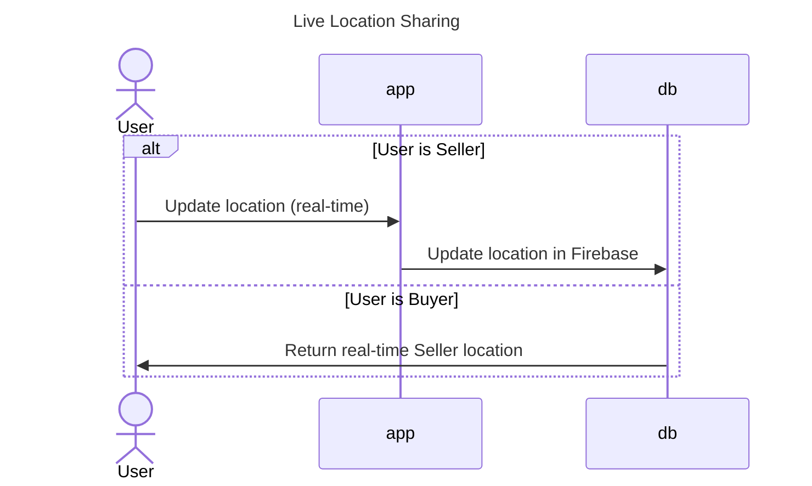
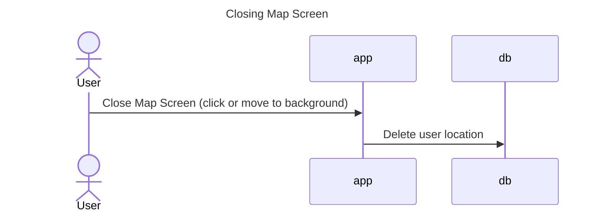

# 🍜 Aku Butuh Bakso !
Udah sore, udara dingin, enaknya makan **bakso**. 

> Mang **bakso** nya mana ya?

Aplikasi ini membantu penjual atau calon pembeli bakso untuk saling menemukan satu sama lain!

# How To Run
## Google Maps Config

To add your Maps API key to this project:
1.  If the secrets.properties file does not exist, create it in the same folder as the local.properties file.
2.  Add this line, where "YOUR_API_KEY" is your API key: MAPS_API_KEY=YOUR_API_KEY

